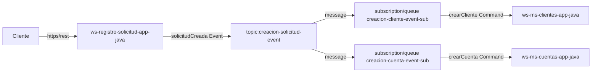
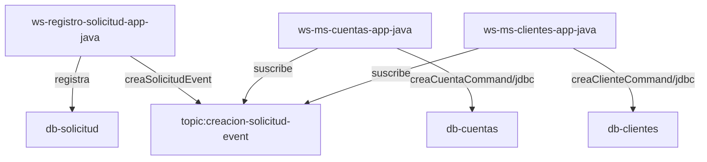

# Proyecto de Gestión de Eventos e Integración con Azure Service Bus


**Autor:** [ngmartinezs](https://github.com/ngmartinezs)

[](https://opensource.org/licenses/Apache-2.0)
[](https://www.oracle.com/java/technologies/javase/jdk11-archive-downloads.html)
[](https://spring.io/projects/spring-boot)
[](https://azure.microsoft.com/en-us/services/service-bus/)
[](https://maven.apache.org/download.cgi)

# ngmartinezs-event-management-spring-boot-asb

### Decripción del Proyecto

Este proyecto ejemplifica el funcionamiento de un sistema basado en eventos utilizando Java 21 con Spring Boot. El sistema gestiona la integración y comunicación entre servicios mediante Azure Service Bus. El proyecto contiene tres subproyectos:


## Subproyectos
1. **ws-registro-solicitud-app-java**: Este subproyecto permite desplegar un servicio web que expone un endpoint y recurso para realizar la solicitud de creacion de un registro a un producto, pasando la informacion del cliente y el producto.
2. **ws-ms-cuentas-app-java**: Contiene un componente que se suscribe a una cola y un topic en Azure Service Bus, activándose tras el registro de una solicitud.
3. **ws-ms-clientes-app-java**: Contiene un componente Spring Boot que atiende los registros cuando se crea una solicitud de afiliación.




## Tabla de Contenidos
- [Descripción del Proyecto](#descripción-del-proyecto)
- [Arquitectura del Sistema](#arquitectura-del-sistema)
- [Pre-requisitos](#pre-requisitos)
- [Configuración del Proyecto](#configuración-del-proyecto)
- [Subproyectos](#subproyectos)
  - [ws-registro-solicitud-app-java](#ws-registro-solicitud-app-java)
  - [ws-ms-cuentas-app-java](#ws-ms-cuentas-app-java)
  - [ws-ms-clientes-app-java](#ws-ms-clientes-app-java)
- [Ejecutando el Proyecto](#ejecutando-el-proyecto)
- [Contribuciones](#contribuciones)
- [Licencia](#licencia)

## Descripción del Proyecto

Este proyecto es un ejemplo de cómo implementar un sistema distribuido basado en eventos utilizando Java 21 y Spring Boot. Se utiliza Azure Service Bus para la mensajería y coordinación entre los servicios.

## Arquitectura de Contexto

A continuación se muestra un diagrama de la arquitectura de contexto que indica como se presenta la interaccion entre los servicios y los eventos generados.



## Pre-requisitos

- JDK 21
- Apache Maven 3.6+
- Cuenta de Azure con acceso a Azure Service Bus
- IDE como IntelliJ IDEA o Eclipse

## Configuración del Proyecto

1. Clonar el repositorio:

   ```bash
   git clone ngmartinezs-event-management-spring-boot-asb.git
   cd ngmartinezs-event-management-spring-boot-asb

2. Crear una cuenta de Azure y configurar un Service Bus.

    - Crear un namespace en Azure Service Bus.
    - Crear una cola y un topic.
    - Obtener la cadena de conexión de Azure Service Bus y agregarla a los archivos de configuración de Spring Boot (application.properties o application.yml).

3. Configurar los subproyectos para que utilicen la cadena de conexión de Azure Service Bus.

## Subproyectos
### ws-registro-solicitud-app-java
Este subproyecto permite desplegar un servicio web que expone un endpoint y recurso para realizar la solicitud de creacion de un registro a un producto, pasando la informacion del cliente y el producto.

#### Funciones Principales:

- API REST para registrar solicitudes.
- Registrar la solicitud recibida en una base de datos de solicitud.
- Uan vez es confirmado que la solicitud fue creada se genera un menssage hacia Azure Service Bus informando a un topic indicando que una solicitud ha sido creada.
##### Configuración:
###### application.properties
```
spring.application.name=ws-registro-solicitud-app
azure.servicebus.connection-string=tu_cadena_de_conexion
```
##### Ejecucion:
```bash
cd ws-registro-solicitud-app-java
mvn spring-boot:run
```
### ws-ms-cuentas-app-java
Este subproyecto contiene un componente que se suscribe a una y un topic en Azure Service Bus, activándose tras el registro de una solicitud.

#### Funciones Principales: 
1. Escucha de mensajes de la cola y topic de Azure Service Bus.
2. Procesamiento de solicitudes de registro.
3. Efectua la creación de una cuenta asociada al mensaje de la solicitud recibida.
##### Configuración:
###### application.properties
```
spring.application.name=ws-registro-solicitud-app
azure.servicebus.connection-string=tu_cadena_de_conexion
```
##### Ejecucion:
```bash
cd ws-registro-solicitud-app-java
mvn spring-boot:run
```
### ws-ms-clientes-app-java
Este subproyecto contiene un componente Spring Boot que atiende los registros cuando se crea una solicitud de registro a un producto, gestionando la creacion del cliente asociado al producto.

#### Funciones Principales:
1. Procesamiento de solicitudes de afilia.
2. Creación de cuentas de clientes.
3. Efectua la creación de un cliente asociada al mensaje de la solicitud recibida.
##### Configuración:
###### application.properties
```
spring.application.name=ws-registro-solicitud-app
azure.servicebus.connection-string=tu_cadena_de_conexion
```
##### Ejecucion:
```bash
cd ws-registro-solicitud-app-java
mvn spring-boot:run
```
## Ejecutando el Proyecto   
1. Ejecutar el subproyecto ws-registro-solicitud-app-java.
2. Ejecutar el subproyecto ws-ms-cuentas-app-java.
3. Ejecutar el subproyecto ws-ms-clientes-app-java.

## Contribuciones
Las contribuciones son bienvenidas. Para cambios importantes, por favor, abre un issue primero para discutir qué te gustaría cambiar.

## Licencia
[MIT](https://choosealicense.com/licenses/mit/)
```
