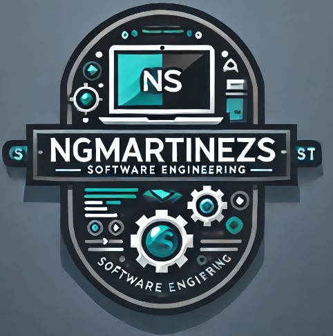
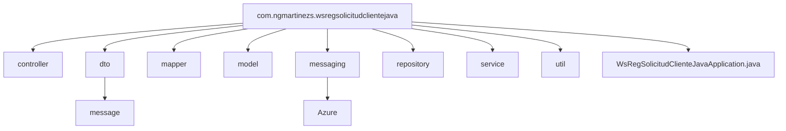
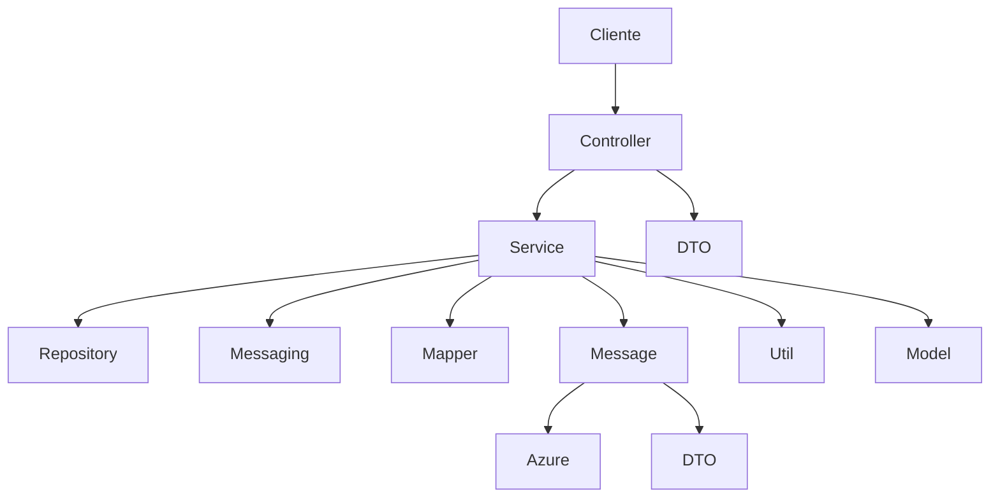
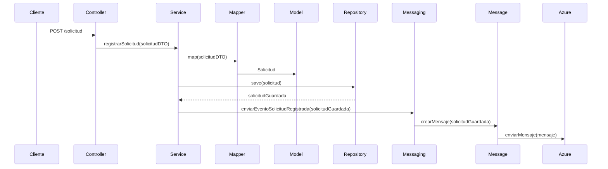
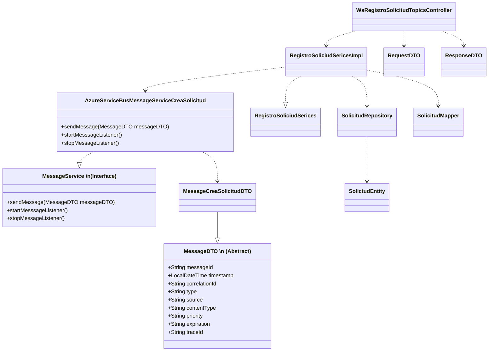
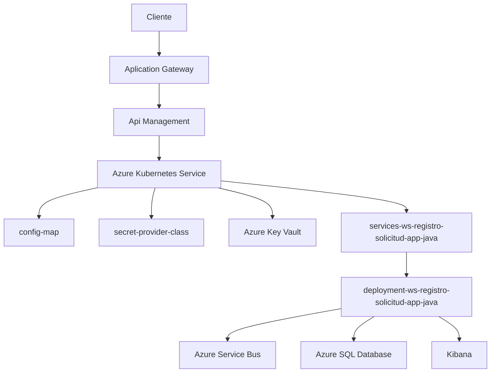
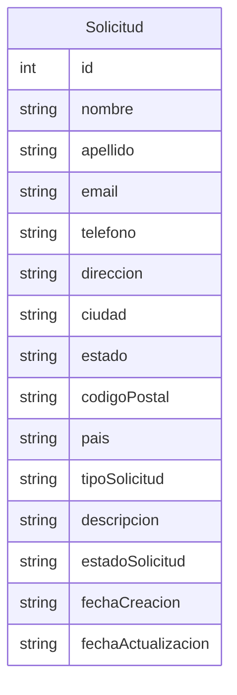

# ws-registro-solicitud-app-java



**Autor:** [ngmartinezs](https://github.com/ngmartinezs)

[](https://opensource.org/licenses/Apache-2.0)
[](https://www.oracle.com/java/technologies/javase/jdk11-archive-downloads.html)
[](https://spring.io/projects/spring-boot)
[](https://azure.microsoft.com/en-us/services/service-bus/)
[](https://maven.apache.org/download.cgi)


Este proyecto Spring Boot, denominado `ws-registro-solicitud-app-java`, está diseñado para facilitar la recepción de comandos de registro de solicitudes y la generación de eventos sobre topics. Utilizando tecnologías como Spring Boot, Spring Cloud Azure, y Azure Messaging Service Bus, este proyecto se posiciona como una solución robusta para la integración y manejo de eventos en arquitecturas basadas en microservicios.

## Características

- **Spring Boot**: Aprovecha las capacidades de autoconfiguración de Spring Boot para simplificar el desarrollo de aplicaciones y servicios.
- **Spring Cloud Azure**: Integración con Azure para el manejo de configuraciones y secretos, facilitando la interoperabilidad con servicios en la nube.
- **Azure Messaging Service Bus**: Utiliza el servicio de bus de mensajes de Azure para la comunicación asíncrona y la distribución de eventos.

## Arquitecura de la aplicación

### Diagrama de paquetes

A continuación se muestra un diagrama de paquetes que representa la estructura general del proyecto `ws-registro-solicitud-app-java`:


#### Descripción de los paquetes

- **controller**: Contiene las clases controladoras que manejan las solicitudes HTTP y definen los puntos de entrada de la API.
- **dto**: Contiene las clases de transferencia de datos (DTO) que se utilizan para transportar información entre las capas de la aplicación.
- **mapper**: Contiene las clases encargadas de mapear los objetos de dominio a DTO y viceversa.
- **model**: Contiene las clases que representan los objetos de dominio de la aplicación.
- **messaging**: Contiene las clases relacionadas con la comunicación asíncrona y la distribución de eventos utilizando Azure Messaging Service Bus.
- **repository**: Contiene las interfaces y clases de repositorio que se utilizan para acceder a la capa de persistencia de datos.
- **service**: Contiene las clases de servicio que implementan la lógica de negocio de la aplicación.
- **util**: Contiene clases de utilidad y funciones auxiliares.
- **WsRegSolicitudClienteJavaApplication.java**: Clase principal que inicia la aplicación Spring Boot.

Este esquema de paquetes proporciona una estructura organizada y modular para el proyecto, facilitando el desarrollo y mantenimiento del código. Cada paquete tiene una responsabilidad específica y contribuye a la arquitectura general de la aplicación.

### Diagrama de componentes

El siguiente diagrama de componentes muestra la interacción entre los componentes principales de la aplicación `ws-registro-solicitud-app-java`:



### Diagrama de secuencia

El siguiente diagrama de secuencia ilustra el flujo de interacción entre los componentes de la aplicación `ws-registro-solicitud-app-java` al procesar una solicitud de registro:



### Diagrama de clases

El siguiente diagrama de clases muestra las clases y sus relaciones en la aplicación `ws-registro-solicitud-app-java`:


Importante resaltar el uso de una interfaz `MessageService` que define los métodos para enviar mensajes y escuchar eventos. La clase `AzureServiceBusMessageServiceCreaSolicitud` implementa esta interfaz y proporciona la lógica para enviar mensajes a Azure Service Bus y escuchar eventos de mensajes.  Adicionalmente, se utiliza una clase abstracta `MessageDTO` que define los atributos comunes de los mensajes y proporciona una estructura base para los mensajes específicos, como `MessageCreaSolicitudDTO`.

### Diagrama de despliegue

El siguiente diagrama de despliegue muestra la arquitectura de despliegue de la aplicación `ws-registro-solicitud-app-java` en un entorno de producción:



En este diagrama, el cliente interactúa con la aplicación a través de un Application Gateway y un API Management. La aplicación se despliega en un Azure Kubernetes Service (AKS) y se conecta a servicios externos como Azure Service Bus y Azure SQL Database. Además, la aplicación utiliza Azure Key Vault para almacenar secretos y configuraciones sensibles, y Kibana para monitorear y analizar los registros de la aplicación.

### Diagrama de Datos

El siguiente diagrama de datos muestra la estructura de la base de datos utilizada por la aplicación `ws-registro-solicitud-app-java`:



En este diagrama, la entidad `Solicitud` representa la estructura de la tabla de base de datos utilizada para almacenar la información de las solicitudes registradas. La entidad contiene varios campos que representan los atributos de una solicitud, como nombre, apellido, email, teléfono, dirección, ciudad, estado, código postal, país, tipo de solicitud, descripción, estado de la solicitud, fecha de creación y fecha de actualización.

## Descripcion de Servicios

El proyecto `ws-registro-solicitud-app-java` consta de los siguientes servicios y componentes principales:

### Listar Solicitudes

**Endpoint:** `GET /solicitudes/listar`

**Descripción:** Servicio para listar las solicitudes registradas.

**Headers:**
- `Content-Type: application/json`

**Request:**
- No requiere parámetros en el cuerpo de la solicitud.

**Response:**
- **200 OK:** Listado de solicitudes registrado exitosamente.
  ```json
  [
    {
      "id": "string",
      "nombre": "string",
      "apellido": "string",
      "email": "string",
      "telefono": "string",
      "direccion": "string",
      "ciudad": "string",
      "estado": "string",
      "codigoPostal": "string",
      "pais": "string",
      "tipoSolicitud": "string",
      "descripcion": "string",
      "estadoSolicitud": "string",
      "fechaCreacion": "string",
      "fechaActualizacion": "string"
    }
  ]
- **500 Internal Server Error:** Error al listar las solicitudes.

### Registrar Solicitud
**Endpoint:** POST /solicitudes

**Descripción:** Servicio para registrar una nueva solicitud.

**Headers:**

Content-Type: application/json
**Request:** 
```json
{
  "nombre": "string",
  "apellido": "string",
  "email": "string",
  "telefono": "string",
  "direccion": "string",
  "ciudad": "string",
  "estado": "string",
  "codigoPostal": "string",
  "pais": "string",
  "tipoSolicitud": "string",
  "descripcion": "string"
}
```
**Response:**
- **201 Created:** Solicitud registrada exitosamente.
  ```json
  {
    "solicitud": {
    "nombre": "string",
    "apellido": "string",
    "email": "string",
    "telefono": "string",
    "direccion": "string",
    "ciudad": "string",
    "estado": "string",
    "codigoPostal": "string",
    "pais": "string",
    "tipoSolicitud": "string",
    "descripcion": "string"
    }
  }
- **200 OK:** Error en el registro de la solicitud.
  ```json
  {
      "mensaje": "Solicitud de registro exisitoso => {idCliente}",
     "codigoRespuesta": "00",
     "mensajeRespuesta": "Solicitud de registro de cliente exitosa"
  }

- **500 Internal Server Error:** Error al registrar la solicitud.

## Estructura Mensajeria Asincrona

El proyecto `ws-registro-solicitud-app-java` utiliza Azure Service Bus para la comunicación asíncrona y la distribución de eventos. La estructura de los mensajes enviados y recibidos por la aplicación se define mediante clases de mensajes específicas que extienden la clase base `MessageDTO`. A continuación se muestra un ejemplo de la estructura de un mensaje de solicitud registrada:

**MessageCreaSolicitudDTO:**
```json
{
  "header": {
    "messageId": "string",
    "timestamp": "string",
    "correlationId": "string",
    "type": "string",
    "source": "string",
    "contentType": "string",
    "priority": "string",
    "expiration": "string",
    "traceId": "string"
  },
  "body": {
    "topic": "string",
    "idCliente": "string",
    "tipoIdentificacion": "string",
    "numeroIdentificacion": "string",
    "nombre": "string",
    "apellido": "string",
    "direccion": "string",
    "telefono": "string",
    "email": "string",
    "tipoSolicitud": "string",
    "fechaSolicitud": "string",
    "fechaCreacion": "string"
  }
}
```

## Comenzando

Para comenzar a trabajar con `ws-registro-solicitud-app-java`, asegúrate de tener Maven y Java 21 instalados en tu entorno de desarrollo. Este proyecto utiliza Maven Wrapper para facilitar la gestión de dependencias y la construcción del proyecto.

### Prerrequisitos

- Java 21
- Maven

### Instalación

Sigue estos pasos para configurar el entorno de desarrollo:

1. Clona el repositorio:

    
    git clone [URL del repositorio]

2. Navega al directorio del proyecto:

    cd ws-registro-solicitud-app-java

3. Ejecuta Maven Wrapper para compilar el proyecto:

    ./mvnw clean install


## Ejecutando las pruebas

Este proyecto utiliza Spring Boot Starter Test para la definición y ejecución de pruebas unitarias y de integración. Para ejecutar las pruebas, utiliza el siguiente comando:

./mvnw test

Para más información sobre cómo contribuir al proyecto, configuraciones avanzadas y guías de desarrollo, consulta la documentación adicional proporcionada en `HELP.md`.


