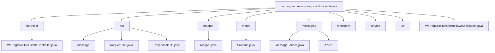

# ws-registro-solicitud-app-java

**Autor:** [ngmartinezs](https://github.com/ngmartinezs)

Este proyecto Spring Boot, denominado `ws-registro-solicitud-app-java`, está diseñado para facilitar la recepción de comandos de registro de solicitudes y la generación de eventos sobre topics. Utilizando tecnologías como Spring Boot, Spring Cloud Azure, y Azure Messaging Service Bus, este proyecto se posiciona como una solución robusta para la integración y manejo de eventos en arquitecturas basadas en microservicios.

## Características

- **Spring Boot**: Aprovecha las capacidades de autoconfiguración de Spring Boot para simplificar el desarrollo de aplicaciones y servicios.
- **Spring Cloud Azure**: Integración con Azure para el manejo de configuraciones y secretos, facilitando la interoperabilidad con servicios en la nube.
- **Azure Messaging Service Bus**: Utiliza el servicio de bus de mensajes de Azure para la comunicación asíncrona y la distribución de eventos.

## Estructura de Paquetes

## Comenzando

Para comenzar a trabajar con `ws-registro-solicitud-app-java`, asegúrate de tener Maven y Java 21 instalados en tu entorno de desarrollo. Este proyecto utiliza Maven Wrapper para facilitar la gestión de dependencias y la construcción del proyecto.

### Prerrequisitos

- Java 21
- Maven

### Instalación

Sigue estos pasos para configurar el entorno de desarrollo:

1. Clona el repositorio:

    
    git clone [URL del repositorio]

2. Navega al directorio del proyecto:

    cd ws-registro-solicitud-app-java

3. Ejecuta Maven Wrapper para compilar el proyecto:

    ./mvnw clean install

## Ejecutando las pruebas

Este proyecto utiliza Spring Boot Starter Test para la definición y ejecución de pruebas unitarias y de integración. Para ejecutar las pruebas, utiliza el siguiente comando:

./mvnw test

Para más información sobre cómo contribuir al proyecto, configuraciones avanzadas y guías de desarrollo, consulta la documentación adicional proporcionada en `HELP.md`.

